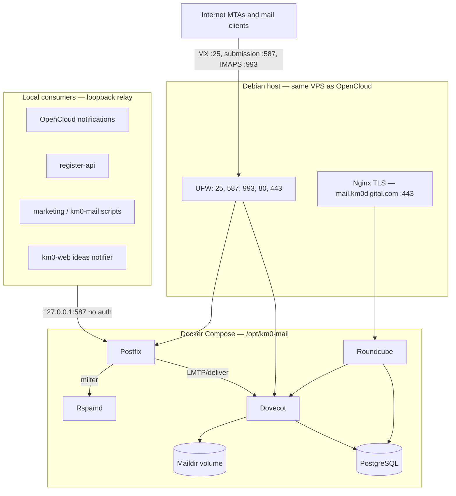

# Pre-plan: Self-hosted mail stack for KM0 Digital

> **Purpose:** GitHub issue draft for implementing production mail on the existing KM0 VPS.  
> **Target:** `mail.km0digital.com` on Debian 13 (same host as OpenCloud), Nginx for webmail TLS only.  
> **Cost model:** Fully self-hosted — **no SaaS mail subscription** (Postfix, Dovecot, Rspamd, Roundcube are open source).

---

## Goal

Provide **send, receive, webmail, and anti-spam** for KM0 Digital on infrastructure we control, without coupling mail identity to OpenCloud LDAP in phase 1.

Users and operators should be able to:

1. Read and send mail via **Roundcube** at `https://mail.km0digital.com`.
2. Use standard mail clients (IMAP/SMTP) with addresses like `user@km0digital.com`.
3. Receive mail from the public Internet (Gmail, Outlook, etc.).
4. Benefit from **Rspamd** filtering on inbound mail.
5. Use **light SMTP integration** for OpenCloud notifications, marketing scripts, registration verification, and km0-web alerts — without shared passwords with OpenCloud.

**Working phrase:** *Deploy the mail stack with Postfix, Dovecot, Rspamd, and Roundcube; OpenCloud identity unification and commercial packaging are decided after the stack is up and running.*

---

## Decision record (agreed)

| Topic | Decision |
|-------|----------|
| **MVP scope** | Operational mailboxes (`noreply@`, `postmaster@`, team) **and** customer mailboxes `@km0digital.com` |
| **Pricing** | Mail treated as included for now; executive pricing decision **after** go-live |
| **Scale target** | **>1,000 mailboxes** by end of year — size disk, queues, and antispam accordingly |
| **Server** | Same VPS as OpenCloud (`116.202.10.106`); shared IP/reputation |
| **Repository** | New Git repo at `/opt/km0-mail` (sibling to `km0-web`, `opencloud`) |
| **Deployment** | Docker Compose (modular services), **not** native Debian packages |
| **Database** | **PostgreSQL** — virtual mail users, Roundcube, future provisioning API |
| **Antivirus** | **Rspamd only** in phase 1; ClamAV optional in phase 2 |
| **Service hostname** | `mail.km0digital.com` (MX, IMAP, SMTP submission, webmail) |
| **User addresses** | `user@km0digital.com` (apex domain — **not** `@mail.km0digital.com`) |
| **DNS registrar** | Joker.com |
| **DMARC (initial)** | `p=none` with aggregate reports (see DNS section) |
| **Inbound SMTP** | Direct reception on port **25** (Hetzner port already open) |
| **Reverse proxy** | Host Nginx for **HTTPS/webmail only**; SMTP/IMAP exposed directly |
| **OpenCloud LDAP** | **Not** unified in phase 1; separate mail passwords |
| **Future identity link** | PostgreSQL `mail_accounts.opencloud_uuid` nullable + documented extension point |
| **Light SMTP integrations (MVP)** | OpenCloud notifications, marketing/`tmp/km0-mail`, register-api verification, km0-web ideas |
| **Canonical sender** | `noreply@km0digital.com` |
| **Quotas (trial)** | Unlimited during trial phase |
| **Backups** | Same cron/pattern as OpenCloud volume backups |
| **Legal** | Update `km0-web` `/legal/` when customer mail goes live at scale |
| **TLS cert** | Dedicated Let's Encrypt cert for `mail.km0digital.com` (no wildcard required) |
| **POP3** | Disabled; IMAP + webmail only |

**Do not use** `@amvara.de` (or other non-`km0digital.com` domains) for KM0 mail roles in this stack. Use `@km0digital.com` mailboxes (`postmaster@`, `noreply@`, etc.).

---

## Current context (what we already have)

| Item | Value |
|------|--------|
| OpenCloud | `opencloudeu/opencloud-rolling:7.0.0` at `https://cloud.km0digital.com` |
| Identity | Dex OIDC + built-in IDM LDAP (BoltDB); **no PostgreSQL** in OpenCloud |
| Corporate web | `https://km0digital.com` (`km0-web`) |
| Host OS | Debian 13, Nginx TLS termination, UFW `22/80/443` |
| Server RAM | 16 GB |
| Outbound mail today | Gmail SMTP (`/opt/tmp/km0-mail/`), AutoMail API (`km0-web` ideas) |
| OpenCloud SMTP env | `NOTIFICATIONS_SMTP_*` supported upstream; not wired to local Postfix yet |
| Self-registration | `register-api` creates IDM users; **email verification not implemented** |
| Mail stack | **Not deployed** |

Campaign scripts under `/opt/tmp/km0-mail/` are **not** the mail infrastructure; they are temporary Gmail send helpers to be replaced by local relay.

---

## Email addresses vs MX (important)

These are different concepts:

| Concept | Example (Gmail) | Example (KM0) |
|---------|-------------------|---------------|
| **User address** | `hello@gmail.com` | `hello@km0digital.com` |
| **Domain in the address** | `gmail.com` | `km0digital.com` |
| **MX hostname (mail delivery target)** | Google infrastructure | `mail.km0digital.com` |

The **MX record** does not appear in the visible email address. It only tells other servers where to deliver mail for `@km0digital.com`.

**Aliases** (e.g. `info@km0digital.com` → one user's mailbox) should be supported from phase 1.

---

## Tooling context

### Postfix

- **Role:** Inbound SMTP (MX), outbound delivery, submission relay for apps on localhost.
- **Docs:** <http://www.postfix.org/documentation.html>

### Dovecot

- **Role:** IMAP mail storage (Maildir), SASL for Postfix submission, user authentication for Roundcube.
- **Docs:** <https://doc.dovecot.org/>

### Rspamd

- **Role:** Anti-spam, DKIM signing, reputation, milter integration with Postfix.
- **Docs:** <https://rspamd.com/doc/>

### Roundcube

- **Role:** Webmail UI behind Nginx HTTPS.
- **Docs:** <https://github.com/roundcube/roundcubemail/wiki>

### PostgreSQL

- **Role:** Virtual user table, Roundcube database, future provisioning metadata (`opencloud_uuid`).

---

## Target architecture

### Component diagram



### Why Nginx does not replace port 25

Host Nginx (HTTP/HTTPS reverse proxy) terminates TLS for **Roundcube only**. Inbound SMTP from other mail servers uses the **SMTP protocol on port 25**, not HTTP.

Optional Nginx `stream` TCP proxy on port 25 adds a hop without removing the need to expose port 25. **Recommended:** publish Postfix/Dovecot ports directly from Docker; use Nginx only for webmail on `:443`.

### Port model

| Service | Port | Exposed publicly | Notes |
|---------|------|------------------|-------|
| SMTP (inbound MX) | **25** | **Yes** | Required to receive Internet mail |
| SMTP submission | **587** | **Yes** | Authenticated send (users + external clients) |
| IMAPS | **993** | **Yes** | Mail clients |
| HTTPS webmail | **443** | **Yes** | Nginx → Roundcube (already open for other sites) |
| HTTP ACME | **80** | **Yes** | Certbot webroot (already open) |
| SMTPS | 465 | No (phase 1) | Redundant if 587 + STARTTLS works |
| IMAP | 143 | No | Use 993 instead |
| POP3 | 110/995 | No | Disabled |

**UFW additions:** allow **25, 587, 993/tcp** in addition to existing rules.

### Internal relay (light integration)

Applications on the same host send via **Postfix on `127.0.0.1:587`** without SMTP auth, restricted by `mynetworks` / Docker bridge CIDRs.

| Consumer | Sender | Phase |
|----------|--------|-------|
| OpenCloud `NOTIFICATIONS_SMTP_*` | `noreply@km0digital.com` | 1 |
| Marketing / bulk scripts (replace Gmail) | `noreply@km0digital.com` | 1 |
| `register-api` verification emails | `noreply@km0digital.com` | 1b |
| `km0-web` ideas notification (replace AutoMail) | `noreply@km0digital.com` | 1 |

Per-service SMTP passwords are **not** required for localhost relay; use them only if a service runs off-host.

---

## DNS configuration (Joker.com)

Create/update records for **`km0digital.com`**:

| Type | Host | Value | Purpose |
|------|------|-------|---------|
| **MX** | `@` | `10 mail.km0digital.com` | Inbound mail for `@km0digital.com` |
| **A** | `mail` | `116.202.10.106` | Mail server hostname |
| **TXT** (SPF) | `@` | `v=spf1 mx a:mail.km0digital.com -all` | Authorised senders (tighten after testing) |
| **TXT** (DKIM) | `mail._domainkey` | *(from Rspamd/Postfix after deploy)* | Outbound signing |
| **TXT** (DMARC) | `_dmarc` | `v=DMARC1; p=none; rua=mailto:postmaster@km0digital.com; adkim=s; aspf=s` | Monitoring mode first |
| **PTR** (Hetzner) | IP → `mail.km0digital.com` | Must match Postfix `myhostname` | Deliverability |

**DMARC progression:** stay at `p=none` until SPF/DKIM pass consistently, then move to `quarantine` and eventually `reject`.

**TLS:** Let's Encrypt certificate for `mail.km0digital.com` via certbot webroot (same pattern as OpenCloud/Collabora vhosts).

---

## Repository layout (proposed)

```
/opt/km0-mail/                         # Git: km0-mail (new repo)
├── docker-compose.yml                 # postfix, dovecot, rspamd, roundcube, postgres
├── .env.example                       # secrets template (chmod 600 on server)
├── nginx/
│   └── sites-available/mail           # Template → /etc/nginx/sites-available/mail
├── config/
│   ├── postfix/
│   ├── dovecot/
│   └── rspamd/
├── scripts/
│   ├── km0-mail-admin                 # create-mailbox, create-alias, list
│   ├── backup-maildir.sh              # aligned with opencloud backup cadence
│   └── verify-mail-stack.sh           # smoke tests
├── sql/
│   └── init/                          # PostgreSQL schema incl. mail_accounts
└── docs/
    ├── issue-mail-preplan.md          # this document
    └── runbook.md                     # operations (created during implementation)
```

Nginx templates live in **`km0-mail`** and deploy to `/etc/nginx/` the same way as `opencloud/nginx/`.

---

## PostgreSQL schema (extension point for future OpenCloud link)

Minimal table for phase 1 provisioning and phase 2 identity sync:

```sql
CREATE TABLE mail_accounts (
    id              SERIAL PRIMARY KEY,
    email           VARCHAR(255) NOT NULL UNIQUE,  -- user@km0digital.com
    password_hash   TEXT NOT NULL,                 -- Dovecot-compatible hash
    opencloud_uuid  VARCHAR(64) NULL,              -- future link to IDM; NULL in phase 1
    quota_bytes     BIGINT NULL,                   -- NULL = unlimited (trial)
    active          BOOLEAN NOT NULL DEFAULT TRUE,
    created_at      TIMESTAMPTZ NOT NULL DEFAULT NOW(),
    updated_at      TIMESTAMPTZ NOT NULL DEFAULT NOW()
);

CREATE TABLE mail_aliases (
    id              SERIAL PRIMARY KEY,
    alias_address   VARCHAR(255) NOT NULL UNIQUE,  -- info@km0digital.com
    target_email    VARCHAR(255) NOT NULL REFERENCES mail_accounts(email),
    created_at      TIMESTAMPTZ NOT NULL DEFAULT NOW()
);
```

Phase 2 options (document only, do not implement in phase 1):

- Sync job: OpenCloud IDM LDAP `mail` + `openCloudUUID` → `mail_accounts`
- Intermediate mapping table + triggers on registration
- Optional SSO for Roundcube via Dex (separate project)

**Phase 1 rule:** mail password is **independent** from OpenCloud password; no LDAP bind for Dovecot.

---

## Implementation phases

### Phase 1 — Core stack + operational mail

- [ ] Create `km0-mail` repo and Compose stack on the VPS
- [ ] PostgreSQL + schema + Maildir volume
- [ ] Postfix + Dovecot + Rspamd (Rspamd only; no ClamAV)
- [ ] UFW: open 25, 587, 993
- [ ] DNS at Joker.com (MX, A, SPF, DKIM, DMARC, PTR)
- [ ] Nginx vhost + Let's Encrypt for `mail.km0digital.com`
- [ ] Roundcube at `https://mail.km0digital.com`
- [ ] Operational mailboxes: `postmaster@`, `noreply@`, team accounts
- [ ] Localhost SMTP relay for OpenCloud + marketing scripts
- [ ] `scripts/backup-maildir.sh` + fail2ban jails (postfix, dovecot)
- [ ] `docs/runbook.md`

### Phase 1b — Customer mailboxes + app integrations

- [ ] CLI provisioning: `km0-mail-admin create-mailbox user@km0digital.com`
- [ ] Alias support (`info@` → mailbox)
- [ ] `register-api` email verification via local Postfix
- [ ] Replace AutoMail in `km0-web` ideas notifier with local relay
- [ ] User-facing doc: configure Apple Mail / Thunderbird / mobile (IMAP 993, SMTP 587)

### Phase 2 — Scale, policy, and optional unification

- [ ] Executive decision on mail pricing / packaging
- [ ] Quotas enforced in PostgreSQL + Dovecot
- [ ] DMARC `p=quarantine` or `p=reject`
- [ ] Optional ClamAV
- [ ] Self-service “activate mail” UI (user-chosen password, no LDAP)
- [ ] OpenCloud identity link via `opencloud_uuid` (best solid design TBD)
- [ ] Legal update on `km0digital.com` for mail data processing

---

## Human prerequisites (operator)

| Prerequisite | Owner | Notes |
|--------------|-------|-------|
| DNS records at Joker.com | Operator | MX, A, SPF, DKIM, DMARC |
| PTR/rDNS at Hetzner | Operator | `mail.km0digital.com` |
| Port 25 reachable | Operator | Confirmed open on Hetzner |
| Create `postmaster@`, `noreply@` mailboxes | Operator | Before DMARC reports and app relay |
| OpenCloud `.env` SMTP vars | Operator | Point to `127.0.0.1:587` |
| GitHub repo `km0-mail` | Operator | Clone to `/opt/km0-mail` |

---

## OpenCloud light integration (configuration draft)

Add to `/opt/opencloud/opencloud-compose/.env` after Postfix is live:

```env
SMTP_HOST=127.0.0.1
SMTP_PORT=587
SMTP_SENDER=OpenCloud Notifications <noreply@km0digital.com>
SMTP_USERNAME=
SMTP_PASSWORD=
SMTP_INSECURE=true
SMTP_AUTHENTICATION=none
SMTP_TRANSPORT_ENCRYPTION=none
```

Exact variable names follow upstream `NOTIFICATIONS_SMTP_*` mapping in `docker-compose.yml`. Loopback relay uses **no auth**; TLS between OpenCloud container and host Postfix is optional (plain on localhost).

**No LDAP or shared password** between OpenCloud login and mail login in phase 1.

---

## Out of scope (phase 1)

- Unified LDAP / same password as OpenCloud
- Keycloak or external user directory for mail
- ClamAV antivirus pipeline
- POP3
- Multi-domain hosting for customer-owned domains (only `@km0digital.com` initially)
- Paid mail SaaS relay (SendGrid, etc.) unless deliverability forces a hybrid later
- Roundcube SSO via Dex OIDC

---

## Test plan

### Infrastructure

```bash
# DNS
dig +short km0digital.com MX
dig +short mail.km0digital.com A

# PTR (from any external host)
dig +short -x 116.202.10.106

# TLS (webmail)
curl -sI https://mail.km0digital.com/ | head

# Ports (from external host)
nc -vz mail.km0digital.com 25
nc -vz mail.km0digital.com 587
nc -vz mail.km0digital.com 993

# Containers
cd /opt/km0-mail && docker compose ps
```

### Functional

| # | Test | Expected |
|---|------|----------|
| 1 | Send test inbound mail to `postmaster@km0digital.com` from Gmail | Delivered; visible in Roundcube |
| 2 | Send outbound from `noreply@` to external address | Received; SPF/DKIM pass in headers |
| 3 | Roundcube login as customer mailbox | Inbox/sent works |
| 4 | IMAP client (993) + SMTP submission (587) with mailbox creds | Send/receive OK |
| 5 | Rspamd score on obvious spam sample | Tagged/rejected per policy |
| 6 | OpenCloud notification (share activity) | Arrives from `noreply@km0digital.com` |
| 7 | `./scripts/verify-mail-stack.sh` | All checks green |
| 8 | Alias `info@` → user mailbox | Delivery to alias works |

### Deliverability checks

- <https://www.mail-tester.com/> or similar — target **8+/10** before marketing sends
- Inspect `Authentication-Results` for `spf=pass`, `dkim=pass`, `dmarc=pass`

### Failure signals

- Inbound mail bounces → MX, port 25, or Postfix `mydestination` / virtual domains
- Outbound spam folder → SPF, DKIM, DMARC, or PTR mismatch
- OpenCloud notifications fail → `mynetworks`, Docker network not allowed to relay
- Roundcube 502 → Nginx upstream or Roundcube container down
- Queue growth → `mailq`, Rspamd/Ops alert

---

## Acceptance criteria

- [ ] `@km0digital.com` addresses send and receive on the public Internet
- [ ] Roundcube live at `https://mail.km0digital.com` with dedicated TLS cert
- [ ] Rspamd active on inbound mail; ClamAV not required for phase 1
- [ ] Operational mailboxes (`postmaster@`, `noreply@`) exist
- [ ] Localhost relay works for OpenCloud notifications and marketing scripts
- [ ] PostgreSQL schema includes `opencloud_uuid` nullable (no sync job yet)
- [ ] Provisioning via CLI script documented
- [ ] DNS SPF, DKIM, DMARC (`p=none`), and PTR configured
- [ ] UFW documents ports 25, 587, 993
- [ ] Backups scheduled (same pattern as OpenCloud volumes)
- [ ] fail2ban jails for postfix and dovecot
- [ ] Secrets only in `.env` (never committed)
- [ ] `docs/runbook.md` in `km0-mail` repo
- [ ] No `@amvara.de` addresses used for KM0 mail roles
- [ ] OpenCloud Dex login and file sync still work (no regression)

---

## Monitoring (minimum)

| Signal | Action |
|--------|--------|
| Postfix queue size | Cron check; alert if `mailq` exceeds threshold |
| Maildir disk usage | Alert before volume fills (1000+ users) |
| Rspamd stats | Periodic review of reject/ham rates |
| fail2ban | postfix-sasl, dovecot jails |
| Alerts | Email to team operational mailbox on `km0digital.com` |

---

## Rollback plan

1. Stop `km0-mail` compose: `docker compose down`
2. Revert OpenCloud SMTP vars to previous outbound (Gmail) if needed
3. Remove/disable Nginx `mail` vhost
4. MX can point elsewhere or be removed to stop inbound delivery
5. Maildir volume retained for data recovery

---

## References

| Resource | URL |
|----------|-----|
| km0 OpenCloud runbook | `/opt/opencloud/docs/runbook.md` |
| km0 OpenCloud README | `/opt/opencloud/README.md` |
| OpenCloud SMTP notifications | upstream `opencloud-compose/docker-compose.yml` (`NOTIFICATIONS_SMTP_*`) |
| Self-registration (no SMTP yet) | `/opt/opencloud/docs/github-issue-self-registration.md` |
| Collabora pre-plan (structure reference) | `/opt/opencloud/docs/issue-collabora-online-preplan.md` |
| Postfix | <http://www.postfix.org/> |
| Dovecot | <https://doc.dovecot.org/> |
| Rspamd | <https://rspamd.com/> |
| Roundcube | <https://roundcube.net/> |

---

## Summary

Deploy **Postfix + Dovecot + Rspamd + Roundcube + PostgreSQL** in a new **`km0-mail`** repository on the **same VPS** as OpenCloud. User addresses are **`user@km0digital.com`**; the MX target is **`mail.km0digital.com`**. Expose ports **25, 587, and 993**; use **Nginx only for HTTPS webmail**. Keep mail passwords **separate** from OpenCloud in phase 1, with a **PostgreSQL extension point** for future identity linking. Wire **light SMTP relay** from localhost for OpenCloud, marketing, registration, and km0-web — canonical sender **`noreply@km0digital.com`**, operational **`postmaster@km0digital.com`**.
