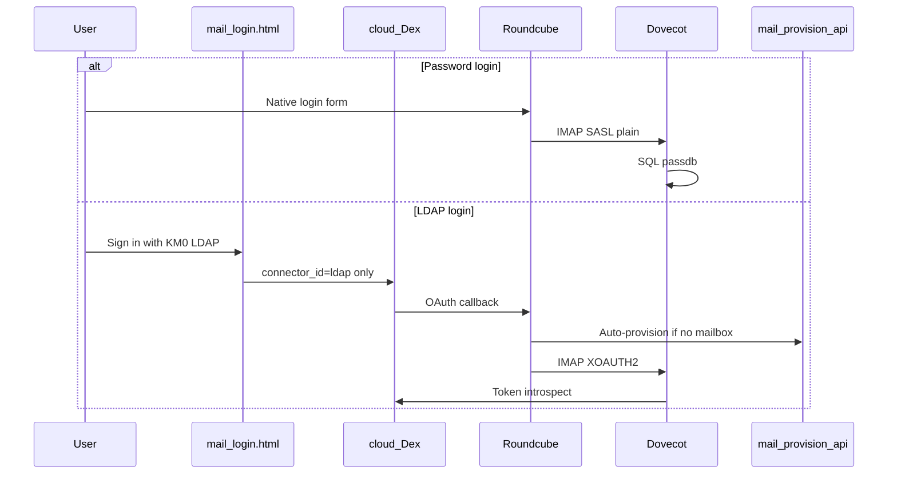
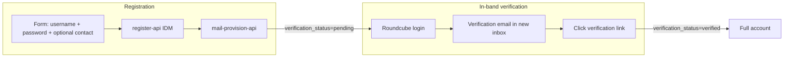
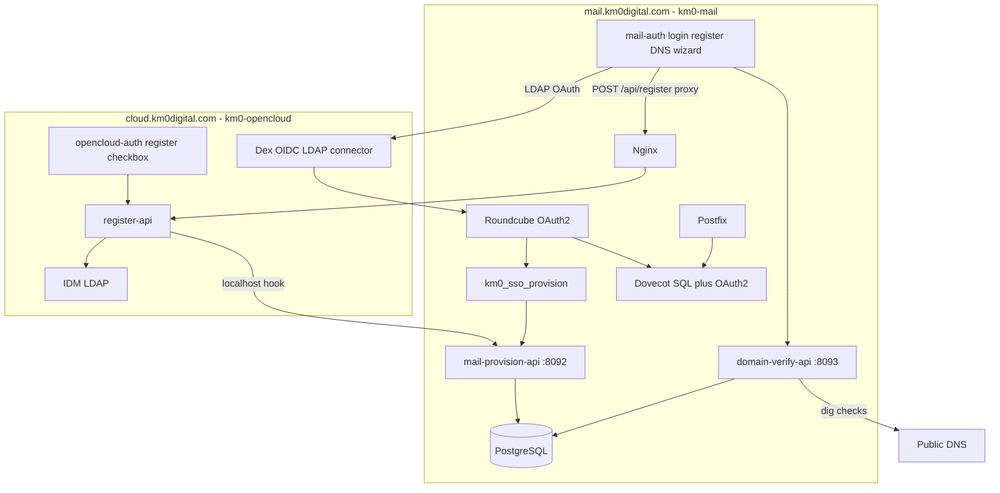

# Pre-plan: Public KM0 Mail registration (Model A + Model B)

> **Purpose:** Integration design for self-service mail registration with unified KM0 identity.  
> **Target:** `mail.km0digital.com` + `cloud.km0digital.com` (cross-repo).  
> **Derived from:** [`issue-mail-preplan.md`](issue-mail-preplan.md), lessons from reverted SSO ([`github-issue-mail-sso.md`](github-issue-mail-sso.md), CHANGELOG 2026-06-16).  
> **Status:** Draft for review — dual auth (password + Dex LDAP OAuth). Google/OIDC remains **Cloud IdP only**; mailbox is always `@km0digital.com` (or verified custom). Freemail = `contact_email`, never the mailbox.

---

## Goal

Enable **public registration** so any user can obtain a KM0 mailbox for free during the trial phase, choosing either:

- **Model A:** an address at `@km0digital.com` (apex only), or
- **Model B:** an address on a **customer-owned domain** (Proton Mail–style DNS verification),

with **unified identity** (one IDM account, one mailbox, one password for Cloud and Mail), **full Dex LDAP webmail login in the same release**, **no Google IdP on Roundcube** (Google stays Cloud IdP; see [Activate Mail for Google/OIDC](#activate-mail-for-googleoidc-cloud-users)), and **no paid third-party integrations** (Google Workspace APIs, SendGrid, etc.).

**Working phrase:** *Ship Model A and Model B with unified register-api, correct LDAP SSO (Dex LDAP only), dual auth (password + OAuth), and in-band verification — applying issue #3 lessons so nothing is deferred half-done.*

---

## Agreed product decisions

| Topic | Decision |
|-------|----------|
| Identity | **Unified:** `register-api` (km0-opencloud) creates IDM user **and** mailbox; same email/password for Cloud and Mail |
| Address models | **A** `@km0digital.com` (apex only, no subdomains) **and** **B** customer-owned domain — **same release** |
| Per-user scope | **1 user = 1 mailbox = 1 address** at registration; user picks **either** KM0 **or** custom domain, not both |
| Custom domains | **Proton Mail–style** self-service DNS verification (see dedicated section) |
| Authentication | **Dual at launch:** (1) email + password via Roundcube native login; (2) **Dex LDAP** via Roundcube OAuth2 + Dovecot XOAUTH2 |
| Google OAuth on Roundcube | **Excluded** — Dex `connector_id=google` is not used for mail UI (spike [#12](https://github.com/AMVARA-CONSULTING/km0-mail/issues/12) → [wontfix](./spike-google-idp-roundcube-mailbox-map.md)) |
| Google / Apple as Cloud IdP | **Allowed** — freemail is `contact_email`; Activate Mail provisions `foo@km0digital.com` + `opencloud_uuid` |
| Freemail (Gmail, Outlook, …) | Maximize end-user convenience **without** third-party APIs or fees (see [freemail policy](#freemail-policy)) |
| Verification | Always confirm identity; `@km0digital.com` users **must be able to log in to webmail** to accept the verification message |
| Pre-verification limits | **Block outbound send only**; inbound + webmail read allowed (see [pre-verification decision](#pre-verification-decision)) |
| Trial limits | **1 user = 1 mailbox**; unlimited storage during trial (per existing pre-plan); anti-abuse rate limits only |
| Cloud registration | **Yes:** optional checkbox on OpenCloud register form to create mail in the same flow |
| Pricing (current phase) | Free / trial; executive packaging decision later |

---

## Closed design decisions (Q&A)

### LDAP webmail decision

**Question:** Roundcube OAuth against Dex LDAP, or classic password login only?

**Decision adopted:** **Both — implemented correctly in the same release.**

The previous issue #3 rollback was caused by integration mistakes (CORS 403, broken login wrapper), not because LDAP OAuth is inherently wrong. This release delivers the **full stack** with explicit guardrails.

| Layer | Launch behaviour |
|-------|------------------|
| **Registration** | `register-api` → IDM (LDAP) user + `mail-provision-api` → `mail_accounts` + Maildir + `opencloud_uuid` |
| **Password login** | Roundcube native form → Dovecot SQL passdb (hash synced from register-api on create/password change) |
| **LDAP login** | Branded `/login.html` → Dex `connector_id=ldap` only → Roundcube OAuth callback → Dovecot XOAUTH2 (token introspection against Dex) |
| **Legacy / ops** | `postmaster@`, CLI-provisioned mailboxes keep SQL passdb only |



**Dex requirements (km0-opencloud):**

| Static client | Purpose |
|---------------|---------|
| `km0-mail-web` | Roundcube OAuth; redirect `https://mail.km0digital.com/index.php/login/oauth` |
| `km0-mail-dovecot` | Confidential client for RFC 7662 token introspection |

**Mail hostname rules:**

- Dex UI on mail pages offers **LDAP connector only** — no Google button, no `connector_id=google`.
- Auto-provision after LDAP OAuth only when OIDC `email` matches the registered mailbox domain (`@km0digital.com` or a verified custom domain).
- Freemail OIDC emails (e.g. `@gmail.com`) → clear error, no mailbox created.

**Issue #3 guardrails (mandatory — “do it right”):**

| Previous failure | Correct approach |
|------------------|------------------|
| Register API CORS 403 | Nginx **same-origin** proxy: `mail.km0digital.com/api/register` → register-api |
| `/login.html` wrapper broke Roundcube login | Branded login is an **entry page** with two paths: link to Roundcube native form **or** LDAP OAuth button — does not replace Roundcube's internal login template |
| `mail-provision-api` postfix reload | Use `docker exec` (not `compose exec`) |
| Half-deployed SSO | All auth tracks ship together; smoke tests cover password **and** LDAP before GA |

**IMAP/desktop clients:** Out of scope for LDAP OAuth (Thunderbird, Apple Mail continue with password). Documented in runbook.

---

### Pre-verification decision

**Question:** Before the user clicks the verification link, what should be restricted?

When a new `@km0digital.com` mailbox is created, it starts as `verification_status=pending`. The user must log in and read the confirmation email **in that same inbox**.

| Option | Behaviour | Verdict |
|--------|-----------|---------|
| **A. Block outbound only** (chosen) | User can log in (password or LDAP), **receive** mail, and **read** webmail. **Cannot send** until verified. Roundcube banner: “Confirm your account.” | Matches requirement; stops spam relay |
| **B. Freeze entire account** | No login until verified | **Rejected** — user cannot open inbox |
| **C. Rspamd quarantine on inbound** | Suspicious inbound held | **Rejected** — risks delaying verification email |

**Implementation:**

- Postfix/Dovecot policy rejects authenticated submission (port 587) for `verification_status=pending`.
- Inbound delivery on port 25 unaffected.
- LDAP OAuth login allowed while pending (same outbound hold applies).
- Model B: outbound hold until DNS verification passes.

---

### Trial limits decision

**1 user = 1 mailbox = 1 address** at registration. No “N domains per user” limit.

| Limit type | Trial policy |
|------------|--------------|
| Mailboxes per user | **1** (fixed at registration) |
| Address choice | **One of:** `@km0digital.com` **or** one custom domain address |
| Storage (`quota_bytes`) | **NULL = unlimited** during trial |
| Anti-abuse | Nginx rate limit on `/api/register`; fail2ban; outbound hold for unverified accounts; optional per-day send cap for accounts younger than 7 days |

Second domain or mailbox per user: **out of scope** (future self-service settings).

---

### Cloud registration decision

OpenCloud register form (`cloud.km0digital.com`) includes an optional checkbox:

> ☐ **Create a KM0 Mail account** (choose `@km0digital.com` or your own domain on the next step)

| Checkbox | Flow |
|----------|------|
| **Unchecked** | IDM user only (current OpenCloud behaviour) |
| **Checked** | `register-api` with `create_mail=true` + `mail_mode`; provision hook; redirect to mail wizard (B) or webmail (A) |

`mail.km0digital.com/register` remains the dedicated mail entry point (same API).

---

## Freemail policy

**Principle:** End users register easily; developers do not integrate Google Workspace APIs or pay SaaS fees.

| Rule | Behaviour |
|------|-----------|
| Mailbox domain | **Block** freemail domains (`gmail.com`, `googlemail.com`, `outlook.com`, `hotmail.com`, `live.com`, `yahoo.com`, `icloud.com`, `proton.me`, …) |
| Contact / recovery email | **Allow** freemail — no API integration |
| Social login on mail | **LDAP via Dex only**; **no Google** button on Roundcube (Google = Cloud IdP + Activate Mail) |
| Delivery to Gmail/Outlook | Standard SMTP (SPF/DKIM/DMARC) |
| Paid relay (SendGrid, etc.) | Out of scope unless deliverability crisis |

Implementation: static blocklist in `register-api` + `mail-provision-api`.

---

## Model B — Proton Mail–style custom domains

### Reference flow (Proton)

1. User declares domain and desired address.
2. Panel shows **TXT** for ownership.
3. User adds TXT; panel polls DNS.
4. Panel shows **MX**, **SPF**, **DKIM**.
5. User configures DNS; panel verifies (“Refresh status”).
6. Domain active.

### Pros for KM0

- Self-service at scale
- Objective ownership proof (TXT + MX)
- Aligned with [`mail_domains`](../sql/init/01-mail-schema.sql) + [`build-hash-maps.sh`](../docker/postfix/build-hash-maps.sh)
- Zero third-party fees
- Familiar UX

### Cons / risks

- DNS support burden (wizard + per-record status + retry)
- Propagation 24–48 h
- Per-domain DKIM ([`dkim_signing.conf`](../config/rspamd/local.d/dkim_signing.conf) today is single-domain)
- Shared IP reputation
- MX cutover downtime for migrants

### Adopted approach

**Proton-style automatic DNS verification**, no manual approval on happy path. Manual review queue for risk-list domains only. **“Check again”** button on DNS status panel.

---

## Registration flows

### Branch A — `@km0digital.com`



1. User chooses “Email @km0digital.com”, enters `username`, password, optional contact (freemail OK).
2. `register-api` creates IDM user; hook → `mail-provision-api` → `mail_accounts`, Maildir, `opencloud_uuid`.
3. `verification_status=pending`; login allowed (password or LDAP).
4. Verification email sent **to the new mailbox** via local Postfix.
5. `https://mail.km0digital.com/verify?token=…` → `verified`.
6. Until verified: outbound blocked; inbound + read OK; Roundcube banner.

### Branch B — customer-owned domain

1. User chooses “My domain”, enters `user@example.com`, password, optional contact.
2. IDM + provision; `mail_domains` row `active=false`, `verification_status=pending`.
3. DNS wizard:

| Step | DNS record | Check |
|------|------------|-------|
| 1 | TXT `@` → `km0-mail-verification=<token>` | Ownership |
| 2 | MX `@` → `mail.km0digital.com` (prio 10) | Inbound |
| 3 | TXT `@` SPF → `v=spf1 mx a:mail.km0digital.com ~all` | Outbound |
| 4 | TXT `mail._domainkey` → Rspamd public key | DKIM |

4. `domain-verify-api` polls DNS → `active=true`, outbound enabled.
5. Freemail domains rejected.

---

## Authentication (Cloud Google IdP ≠ Roundcube Google)

| Method | When | Components |
|--------|------|------------|
| Email + password | Register + webmail + IMAP clients | SQL passdb; hash synced via provision hook |
| Dex **LDAP** OAuth | Webmail “Sign in with KM0 LDAP” | Dex `connector_id=ldap`, Roundcube OAuth2, Dovecot XOAUTH2 introspection |
| Google on Roundcube | **Excluded** | Cloud IdP only; do not map Gmail→IMAP (see #12 spike) |
| Legacy (`postmaster@`, CLI) | Ops mailboxes | SQL passdb unchanged |

**Password sync:** Provision hook writes Dovecot-BLF hash to `mail_accounts` on register and password change so Cloud and Mail passwords stay aligned.

**Post-OAuth auto-provision:** `km0_sso_provision` Roundcube plugin + provision API — if LDAP user has IDM session but no mailbox, silent provision (idempotent), then continue IMAP login. Domain must match mailbox policy (not freemail).

### Activate Mail for Google/OIDC Cloud users

Users who signed into Cloud with Google (or other freemail OIDC) **cannot** use Gmail as the IMAP mailbox (MX/reputation + Dovecot `username_attribute=email`). Flow:

1. Hub / Cloud wizard (opencloud #25, hub #14) → user picks local part `foo`.
2. `register-api` / activate UI ensures IDM can authenticate with `mail=foo@km0digital.com` (password at activation). **opencloud #24** must preserve Google OIDC identity when Graph mail is rewritten — do not ship UX that strands Google re-login.
3. Call `mail-provision-api` `POST /activate` with `local_part`, `opencloud_uuid`, `contact_email` (Gmail), `password`.
4. Entry into Roundcube:
   - **Password** — immediate (`https://mail.km0digital.com/` → native form → SQL passdb).
   - **LDAP OAuth** — preferred SSO once IDM `mail` = mailbox and Dovecot XOAUTH2 (#9) is live; token email claim must equal `foo@km0digital.com`.

Lookups: `GET /lookup/by-uuid/<uuid>` and `GET /lookup/by-contact/<email>` return `activate_required: true` when no mailbox is linked. Linking an existing mailbox without re-hash: `POST /link`.

Primary activate UI is hub + register-api (opencloud #23); km0-mail only exposes the provision APIs and docs.

---

## Integration architecture



### New / restored components in km0-mail

| Component | Responsibility |
|-----------|----------------|
| `host-www/mail-auth/` | `login.html` (password link + LDAP button), `register.html`, DNS wizard, `dex-auth.js` (LDAP only), i18n |
| `docker/mail-provision-api/` | `POST /provision`, `POST /activate`, `POST /link`, lookups by uuid/contact; freemail mailbox blocked; localhost token |
| `docker/domain-verify-api/` | Pending domains, DNS polling, DKIM key generation |
| `config/roundcube/plugins/km0_sso_provision/` | Post-OAuth silent provision hook |
| Roundcube `config.inc.php` | OAuth2 generic → Dex discovery; **no Google provider** |
| Dovecot | Dual passdb: `oauth2` (introspection) + `sql` (plain/login) |
| [`nginx/sites-available/mail`](../nginx/sites-available/mail) | Auth static files + `/api/register` proxy + Roundcube upstream |
| SQL migration | See schema section |

### Changes in km0-opencloud (sibling repo)

| Component | Change |
|-----------|--------|
| `register-api` | `create_mail`, `mail_mode`, `desired_email`, `contact_email`; freemail blocklist; provision hook |
| `host-www/opencloud-auth/register.html` | **Create KM0 Mail account** checkbox |
| Dex `staticClients` | `km0-mail-web`, `km0-mail-dovecot` |
| Dex / mail UI | LDAP connector exposed; **Google connector hidden** on mail hostname |
| Nginx | Same-origin proxy for register-api |

---

## PostgreSQL schema extensions

```sql
-- mail_domains (extend)
ALTER TABLE mail_domains ADD COLUMN owner_opencloud_uuid VARCHAR(64);
ALTER TABLE mail_domains ADD COLUMN verification_token VARCHAR(64);
ALTER TABLE mail_domains ADD COLUMN verification_status VARCHAR(20) DEFAULT 'verified';
ALTER TABLE mail_domains ADD COLUMN mx_verified BOOLEAN DEFAULT FALSE;
ALTER TABLE mail_domains ADD COLUMN spf_verified BOOLEAN DEFAULT FALSE;
ALTER TABLE mail_domains ADD COLUMN dkim_verified BOOLEAN DEFAULT FALSE;
ALTER TABLE mail_domains ADD COLUMN txt_verified BOOLEAN DEFAULT FALSE;
ALTER TABLE mail_domains ADD COLUMN dkim_selector VARCHAR(32) DEFAULT 'mail';

-- mail_accounts (extend)
ALTER TABLE mail_accounts ADD COLUMN verification_status VARCHAR(20) DEFAULT 'pending';
ALTER TABLE mail_accounts ADD COLUMN verification_token VARCHAR(64);
ALTER TABLE mail_accounts ADD COLUMN contact_email VARCHAR(255);
ALTER TABLE mail_accounts ADD COLUMN mail_mode VARCHAR(10); -- 'km0' | 'custom'

-- Issue #13: one mailbox per OpenCloud user + contact lookup
CREATE UNIQUE INDEX IF NOT EXISTS idx_mail_accounts_opencloud_uuid_unique
    ON mail_accounts (opencloud_uuid) WHERE opencloud_uuid IS NOT NULL;
CREATE INDEX IF NOT EXISTS idx_mail_accounts_contact_email
    ON mail_accounts (lower(contact_email)) WHERE contact_email IS NOT NULL;
```

Migration: existing `km0digital.com` → `verification_status=verified`, `active=true`. Apply via `./scripts/apply-registration-migration.sh` (includes `04-one-mailbox-per-uuid.sql`).

Rspamd: regenerate per-domain `dkim_signing.conf` snippet when custom domain activates.

---

## Parallel implementation (single release)

Five tracks — auth is not deferred:

| Track | Deliverables | Depends on |
|-------|--------------|------------|
| **1 — Core** | SQL migration, `mail-provision-api`, `km0-mail-admin` extensions, Postfix/Rspamd reload | — |
| **2 — UI** | `/register` A/B, DNS wizard, Cloud checkbox, `/login.html` branded entry | Track 1 |
| **3 — Verification** | In-band email tokens; DNS poller; `noreply@` transactional mail; outbound hold policy | Tracks 1–2 |
| **4 — Password auth** | Hash sync; Roundcube native login; verification banner | Track 1 |
| **5 — LDAP SSO** | Dex clients, Roundcube OAuth2, Dovecot XOAUTH2, `km0_sso_provision`, LDAP smoke tests | Tracks 1, 4 |

Tracks 4 and 5 can proceed in parallel after Track 1. **GA requires all five.**

---

## Out of scope (this pre-plan)

- Google IdP **directly** into Roundcube (spike #12 — optional later; not required for Activate Mail)
- Google Workspace APIs
- Subdomains `*.km0digital.com`
- Multiple mailboxes or domains per user after registration
- Native mail client LDAP OAuth (Thunderbird / Apple Mail)
- Paid SMTP relay
- External verification providers (SendGrid, etc.)
- Second Dex instance on `mail.km0digital.com`

---

## Risks and mitigations

| Risk | Mitigation |
|------|------------|
| SSO repeat of issue #3 | Same-origin proxy; login.html as entry not replacement; automated smoke in `verify-mail-stack.sh` |
| Abuse / spam relay | Rate limits; fail2ban; outbound hold for pending accounts |
| IP blocklists | DMARC `p=none`; Rspamd monitoring |
| Misconfigured DNS (B) | Wizard + per-record status |
| IDM password ≠ mail password | Provision hook hash sync on register/password change |
| LDAP email domain mismatch | Reject freemail OIDC claims; only provision matching verified domain |

---

## Acceptance criteria (smoke)

**Model A**

- [ ] Register `newuser@km0digital.com` creates IDM + mailbox
- [ ] Password login before verify; confirmation email in inbox
- [ ] LDAP login before verify; same inbox access
- [ ] After verify, outbound send enabled
- [ ] `@gmail.com` as mailbox rejected; as contact accepted

**Model B**

- [ ] Register `user@customer.com` creates `pending` domain
- [ ] Wizard shows correct TXT/MX/SPF/DKIM
- [ ] After DNS OK, inbound + DKIM-signed outbound work

**Auth (launch — complete)**

- [ ] Unified password works on Cloud and Roundcube
- [ ] LDAP login via Dex → Roundcube inbox (token email = mailbox; no Google IdP on Roundcube)
- [ ] No Google button on mail pages (Google = Cloud IdP + Activate Mail)
- [ ] LDAP user without mailbox → silent auto-provision when domain matches
- [ ] Freemail OIDC email alone → no mailbox; Activate Mail required
- [ ] `POST /activate` → `foo@km0digital.com` + uuid + contact_email; password Roundcube login works
- [ ] `postmaster@` password login still works

**Cloud registration**

- [ ] Checkbox creates mail in same flow
- [ ] Unchecked → IDM only

**Cross-repo**

- [ ] `register-api` provision hook idempotent
- [ ] Linked issues on AMVARA-CONSULTING/km0-mail and km0-opencloud

---

## Related documents

| Document | Role |
|----------|------|
| [`issue-mail-preplan.md`](issue-mail-preplan.md) | Core mail stack |
| [`github-issue-mail-sso.md`](github-issue-mail-sso.md) | Prior SSO attempt (reference + guardrails) |
| [`github-issue-roundcube-login-ui.md`](github-issue-roundcube-login-ui.md) | Login skin (done) |
| [`runbook.md`](runbook.md) | Operations |

---

## Next steps

1. Review and approve this pre-plan.
2. Open linked implementation issues on **km0-mail** and **km0-opencloud**.
3. Update [`issue-mail-preplan.md`](issue-mail-preplan.md) cross-references (multi-domain → registration pre-plan).
4. Implement tracks 1–5; GA only when all smoke criteria pass.
