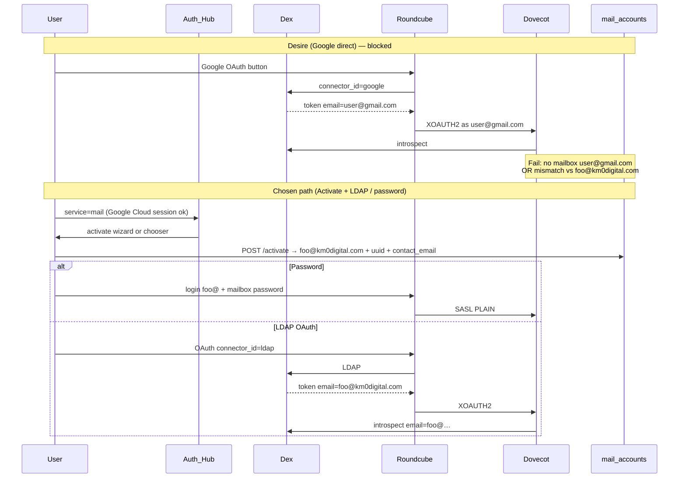

# SPIKE: Google IdP → Roundcube as `foo@km0digital.com`

> **Issue:** [#12](https://github.com/AMVARA-CONSULTING/km0-mail/issues/12)  
> **Status:** **Decision C — wontfix** (keep Dex LDAP OAuth + password; no Google connector on Roundcube)  
> **Date:** 2026-07-25  
> **Pipeline:** Step 9 in [`agent-pipeline-mail-activate.md`](./agent-pipeline-mail-activate.md)

## Desire

A Google button on webmail that opens Roundcube with IMAP user `foo@km0digital.com`, even though the Google account email is `user@gmail.com`.

## Hard constraints (observed)

| Layer | Constraint |
|-------|------------|
| Product | Cloud IdP = Google/Apple (freemail = `contact_email`). Mailbox is always `foo@km0digital.com` (or verified custom). |
| Roundcube 1.6.9 | After OIDC token exchange, IMAP username is taken from `oauth_identity_fields` (default `email`) on the **token/userinfo identity**. `plugins->exec_hook('oauth_login', …)` is called but **its return value is discarded** — plugins cannot rewrite `username` for IMAP. |
| Dovecot CE 2.4 | OAuth2 passdb uses `username_attribute = email` and introspects the **same** access token Roundcube presents via XOAUTH2. Token `email` must equal the mailbox local identity. |
| Dex | Google connector issues tokens whose `email` is Gmail. LDAP connector issues tokens whose `email` is the IDM mail (`foo@km0digital.com`). |

Verified in container (`roundcube/roundcubemail:1.6.9-apache`): `program/include/rcmail_oauth.php` sets `$username` from identity fields, runs the hook for side effects only, then returns the **pre-hook** `$username`.

## Desired vs actual identity flow

## Options

### A — Patch Roundcube + claim/map

- Fork or patch `rcmail_oauth.php` to honour `oauth_login` return `username`, **and** map Gmail → mailbox (e.g. `mail_accounts.contact_email` / `opencloud_uuid`).
- Dovecot still introspects the Google token: `email` remains Gmail unless Dex or a custom token bridge rewrites claims.
- Requires either:
  - a Dex/OIDC claim mapper that sets `email` to the mailbox (breaks Google as Cloud IdP elsewhere), or
  - Dovecot username rewrite + validation against a different claim (non-trivial; still must authorize that Google subject owns `foo@`).
- **Cost:** Roundcube patch maintenance on every image bump; dual identity semantics; easy to strand Cloud Google re-login (see opencloud #24).
- **Verdict:** Reject for phase 1+.

### B — Token exchange → IMAP PLAIN

- After Google OIDC, a trusted backend exchanges identity for a short-lived mailbox password or SASL PLAIN session (or issues a Dex LDAP token via token exchange).
- Feasible in theory (OAuth token exchange / internal mint), but adds a privileged broker, secret handling, and a second auth path beside XOAUTH2.
- **Cost:** New attack surface; overlaps Activate + existing password path; does not simplify hub UX.
- **Verdict:** Reject unless a future product mandate requires one-click Google→inbox without LDAP password.

### C — Wontfix (keep LDAP OAuth + password) — **chosen**

- Roundcube OAuth stays `oauth_auth_parameters = ['connector_id' => 'ldap']` ([`config/roundcube/config.inc.php`](../config/roundcube/config.inc.php)).
- Google remains **Cloud-only** IdP; Activate Mail (#10 / opencloud #23–#25) creates `foo@km0digital.com`.
- Entry after activate: mailbox **password** (required for verify mail) and/or **Dex LDAP OAuth** (token `email` = mailbox).
- Hub (#14) already routes Google+`service=mail` to activate / password / LDAP chooser — no silent Google→Roundcube.

## Decision

**Option C.** Do not enable Dex `connector_id=google` for Roundcube. Do not PoC A/B in this repo.

Rationale:

1. Roundcube core ignores username rewrite from `oauth_login` (no PoC without fork).
2. Dovecot `username_attribute=email` correctly binds XOAUTH2 to the token email; freemail ≠ mailbox by design.
3. Product and registration pre-plans already exclude Google on Roundcube; hub + activate path covers the UX goal.
4. Shipping A/B would race identity fixes (#24) and risk regressing password / LDAP OAuth (#9).

## Explicit non-goals

- No Roundcube core patch.
- No second OAuth client pointed at Google for mail.
- No change to Dovecot oauth2 template for Google tokeninfo.

## References

- [`agent-pipeline-mail-activate.md`](./agent-pipeline-mail-activate.md)
- [`issue-mail-registration-preplan.md`](./issue-mail-registration-preplan.md) (Google OAuth on Roundcube = excluded)
- [`opencloud-registration-integration.md`](./opencloud-registration-integration.md)
- Hub FEAT #14 / activate API #10 / Dovecot OAuth #9
